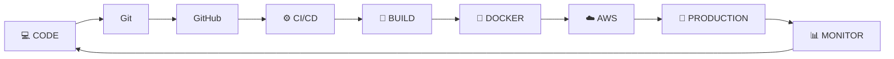

<!-- ======================= HEADER ======================= -->

<div align="center">


<a href="YOUR_LINKEDIN_URL">

</a>

<a href="mailto:YOUR_EMAIL">

</a>

<a href="https://github.com/YOUR_USERNAME">

</a>

<br><br>


</div>

---

## 👨‍💻 About Me

```yaml id="52t8hm"
name: Om Kute
role: DevOps & Cloud Enthusiast
location: India

focus:
  - Cloud Infrastructure
  - DevOps Engineering
  - CI/CD Automation
  - Linux Administration
  - Containerization

currently_working_on:
  - AWS Projects
  - Docker
  - CI/CD Pipelines

next_targets:
  - Kubernetes
  - Terraform
  - Prometheus
  - Grafana

motto: "Build. Automate. Deploy. Improve."
```

---

# ⚡ Tech Arsenal

<div align="center">

### ☁️ Cloud & Infrastructure


<br><br>

### 🐳 DevOps & Automation


<br><br>

### 💻 Development


<br><br>

### 🚀 Building Next


</div>

---

# 🚀 DevOps Lifecycle

<div align="center">



</div>

---

# 🧩 DevOps Stack

<div align="center">

|     | Technology               | Purpose                    |
| :-: | :----------------------- | :------------------------- |
|  ☁️ | **AWS**                  | Cloud Infrastructure       |
|  🐧 | **Linux / Ubuntu**       | Server Administration      |
|  🔧 | **Git & GitHub**         | Version Control            |
|  🐳 | **Docker**               | Containerization           |
|  ⚙️ | **Jenkins**              | CI/CD Automation           |
|  🌐 | **Nginx**                | Web Server / Reverse Proxy |
|  📜 | **Bash**                 | Automation & Scripting     |
|  ☸️ | **Kubernetes**           | Container Orchestration    |
| 🏗️ | **Terraform**            | Infrastructure as Code     |
|  📊 | **Prometheus + Grafana** | Monitoring                 |

</div>

---

# 🏆 Featured DevOps Projects

<table>

<tr>

<td width="50%">

### ☁️ AWS Web Deployment

Deploying web applications on AWS EC2 with Linux and Nginx.

**Stack**

`AWS` `EC2` `Linux` `Nginx` `Git`

<br>

<a href="YOUR_PROJECT_LINK">

</a>

</td>

<td width="50%">

### 🐳 Docker Deployment

Containerizing applications to create portable and consistent environments.

**Stack**

`Docker` `Linux` `Nginx` `Git`

<br>

<a href="YOUR_PROJECT_LINK">

</a>

</td>

</tr>

<tr>

<td width="50%">

### ⚙️ CI/CD Pipeline

Automating application build and deployment workflows.

**Stack**

`GitHub` `Jenkins` `Docker` `AWS`

<br>

<a href="YOUR_PROJECT_LINK">

</a>

</td>

<td width="50%">

### 🅿️ Smart Parking System

Smart parking solution designed for efficient parking management.

**Stack**

`Development` `Automation` `Database`

<br>

<a href="YOUR_PROJECT_LINK">

</a>

</td>

</tr>

</table>

---

# 📊 GitHub Analytics

<div align="center">


<br>


</div>

---

# 📈 Contribution Activity

<div align="center">


</div>

---

# 🐍 Contribution Snake

<div align="center">

<picture>

<source media="(prefers-color-scheme: dark)"
srcset="https://raw.githubusercontent.com/YOUR_USERNAME/YOUR_USERNAME/output/github-contribution-grid-snake-dark.svg">

<source media="(prefers-color-scheme: light)"
srcset="https://raw.githubusercontent.com/YOUR_USERNAME/YOUR_USERNAME/output/github-contribution-grid-snake.svg">


</picture>

</div>

---

# 🗺️ DevOps Journey

```text id="s4vb97"
                       DEVOPS ROADMAP

 Linux ──────► Git/GitHub ──────► AWS
   │                               │
   │                               ▼
   │                            Docker
   │                               │
   │                               ▼
   │                             CI/CD
   │                               │
   │                               ▼
   │                            Jenkins
   │                               │
   │                               ▼
   └────────────────────────► Kubernetes
                                   │
                              ┌────┴────┐
                              ▼         ▼
                         Terraform   Monitoring
                                      │
                               ┌──────┴──────┐
                               ▼             ▼
                          Prometheus      Grafana
```

---

# 📌 Current Progress

```text id="0b29k5"
Linux           ███████████████████░   95%
Git & GitHub    ███████████████████░   95%
AWS             ████████████████░░░░   80%
Nginx           ████████████████░░░░   80%
Docker          ██████████████░░░░░░   70%
CI/CD           ███████████░░░░░░░░░   55%
Jenkins         █████████░░░░░░░░░░░   45%
Kubernetes      █████░░░░░░░░░░░░░░░   25%
Terraform       ███░░░░░░░░░░░░░░░░░   15%
```

---

# 🧠 What I'm Currently Building

```bash id="l8nv00"
$ whoami
> DevOps & Cloud Enthusiast

$ current_focus
> AWS + Docker + CI/CD

$ learning_next
> Jenkins → Kubernetes → Terraform

$ mission
> Automate infrastructure. Simplify deployments. Build reliable systems.

$ status
> ████████████████████ KEEP BUILDING 🚀
```

---

# 🏅 GitHub Achievements

<div align="center">


</div>

---

# 📫 Let's Connect

<div align="center">

### Interested in DevOps • Cloud • Linux • Automation

<br>

<a href="YOUR_LINKEDIN_URL">

</a>

<a href="mailto:YOUR_EMAIL">

</a>

<a href="https://github.com/YOUR_USERNAME">

</a>

</div>

<br>

<div align="center">


### `while(alive) { learn(); build(); automate(); deploy(); }`

⭐ **From code to cloud — one deployment at a time.**

</div>
