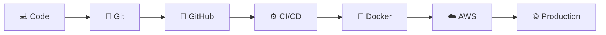
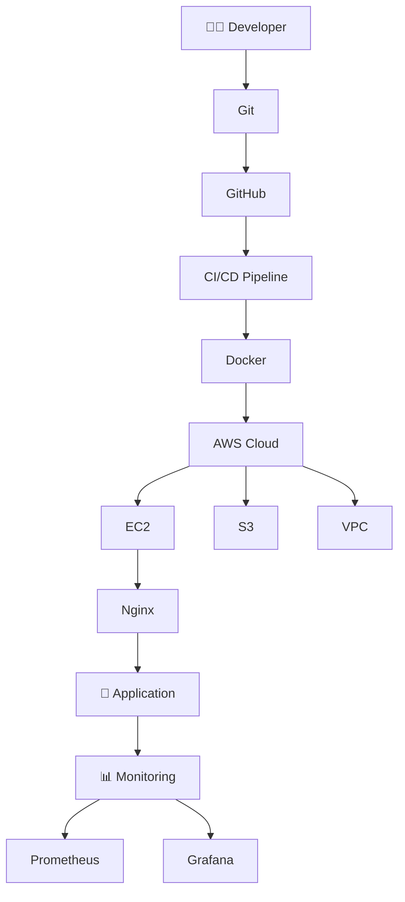

<!-- ===================== DEVOPS TERMINAL ===================== -->

<div align="center">

# ⚡ DEVOPS CONTROL CENTER

```text
┌───────────────────────────────────────────────────────────────┐
│  USER        : Om                                             │
│  ROLE        : DevOps & Cloud Enthusiast                      │
│  SYSTEM      : Linux                                          │
│  CLOUD       : AWS                                            │
│  STATUS      : 🟢 Learning • Building • Automating            │
└───────────────────────────────────────────────────────────────┘
```

</div>

```bash
om@devops:~$ whoami
DevOps & Cloud Enthusiast

om@devops:~$ cat current-focus.txt
☁️ AWS
🐳 Docker
⚙️ CI/CD
🐧 Linux
🔧 Git & GitHub

om@devops:~$ echo $MISSION
"Automate everything that should not be manual."

om@devops:~$ ./career.sh
[████████████████████████░░░░░░] Building...
```

---

# 🚀 Deployment Pipeline



---

# 🛰️ Infrastructure Map



---

# 🧠 `/etc/devops/skills.conf`

```ini
[Operating_System]
Linux=true
Ubuntu=true
Shell_Scripting=true

[Version_Control]
Git=true
GitHub=true

[Cloud]
AWS=true
EC2=true
S3=true
IAM=true
VPC=learning

[Containers]
Docker=learning
Docker_Compose=learning

[CI_CD]
GitHub_Actions=learning
Jenkins=learning

[Web_Server]
Nginx=true

[Infrastructure_As_Code]
Terraform=next

[Orchestration]
Kubernetes=next

[Monitoring]
Prometheus=next
Grafana=next
```

---

# 🐳 `docker-compose.yml` — My DevOps Journey

```yaml
services:

  linux:
    image: ubuntu
    status: running

  git:
    depends_on:
      - linux
    status: running

  aws:
    depends_on:
      - linux
      - git
    status: learning

  docker:
    depends_on:
      - linux
    status: learning

  cicd:
    depends_on:
      - git
      - docker
    status: upcoming

  kubernetes:
    depends_on:
      - docker
    status: queued

  terraform:
    depends_on:
      - aws
    status: queued

  monitoring:
    depends_on:
      - kubernetes
    status: queued
```

---

# 🔄 System Logs

```log
[ OK ] Linux fundamentals loaded
[ OK ] Git initialized
[ OK ] GitHub connected
[ OK ] SSH authentication configured
[ OK ] Nginx server deployed
[ OK ] AWS EC2 instance launched

[ .. ] Docker loading...
[ .. ] CI/CD pipeline loading...
[ .. ] Jenkins loading...

[ -- ] Kubernetes queued
[ -- ] Terraform queued
[ -- ] Prometheus queued
[ -- ] Grafana queued
```

---

# 🏗️ Current Architecture

```text
                    ┌───────────────┐
                    │   Developer   │
                    │      💻       │
                    └───────┬───────┘
                            │
                         git push
                            │
                            ▼
                    ┌───────────────┐
                    │    GitHub     │
                    │      🐙       │
                    └───────┬───────┘
                            │
                         Trigger
                            │
                            ▼
                    ┌───────────────┐
                    │     CI/CD     │
                    │      ⚙️       │
                    └───────┬───────┘
                            │
                           Build
                            │
                            ▼
                    ┌───────────────┐
                    │    Docker     │
                    │      🐳       │
                    └───────┬───────┘
                            │
                          Deploy
                            │
                            ▼
                    ┌───────────────┐
                    │     AWS       │
                    │      ☁️       │
                    └───────┬───────┘
                            │
                            ▼
                    ┌───────────────┐
                    │  Production   │
                    │      🚀       │
                    └───────────────┘
```

---

# ⚔️ DevOps Arsenal

<div align="center">


<br><br>


</div>

---

# 📡 GitHub System Monitor

<div align="center">


<br>


<br>


</div>

---

# 🐍 Contribution Pipeline

<div align="center">

<picture>
  <source media="(prefers-color-scheme: dark)"
          srcset="https://raw.githubusercontent.com/YOUR_USERNAME/YOUR_USERNAME/output/github-contribution-grid-snake-dark.svg">
  <source media="(prefers-color-scheme: light)"
          srcset="https://raw.githubusercontent.com/YOUR_USERNAME/YOUR_USERNAME/output/github-contribution-grid-snake.svg">
  
</picture>

</div>

---

# 🎯 `roadmap.sh`

```bash
#!/bin/bash

echo "🚀 Starting DevOps Journey..."

skills=(
    "Linux"
    "Networking"
    "Git & GitHub"
    "AWS"
    "Docker"
    "CI/CD"
    "Jenkins"
    "Kubernetes"
    "Terraform"
    "Prometheus"
    "Grafana"
)

for skill in "${skills[@]}"
do
    echo "⚙️ Learning $skill..."
done

echo "☁️ Destination: DevOps Engineer"
```

---

<div align="center">

```text
╔══════════════════════════════════════════════════════╗
║                                                      ║
║      CODE → BUILD → TEST → DEPLOY → MONITOR          ║
║                       ↖                              ║
║                       REPEAT                         ║
║                                                      ║
╚══════════════════════════════════════════════════════╝
```

### ☁️ Cloud is the platform.

### ⚙️ Automation is the mindset.

### 🚀 DevOps is the journey.


**⭐ Thanks for visiting my DevOps Control Center**

</div>
